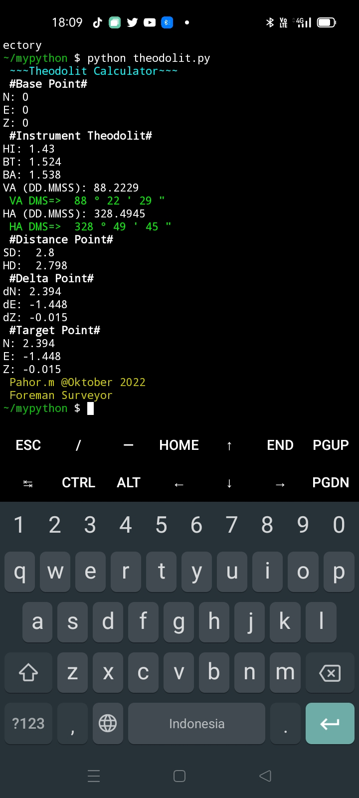

#### mypython
Beerisi file-file kode python yang kami buat untuk
Di jadikan acuan untuk pembelajaran.

#### atan2.py
Contoh kode untuk penggunaan piranti math.atan2.

Input :
- Global Base Point NEZ
- Global Target Point NEZ

Output :
- Sudut horizontal *(HA)*
- Jarak datar antara 2 titik *(HD)*

*ScreenShot Layar HP Oppo A55*

#### theodolit.py
Contoh kode untuk menghitung data ukur theodolit

Input :
- Global Base Point N *(N)*
- Global Base Point E *(E)*
- Global Base Point Z *(Z)*

- Tinggi Alat *(HI)*
- Benang Tengah *(BT)*
- Benang Atas *(BA)*

Output :
- Jarak miring *(SD)*
- Jarak datar *(HD)*

- Delta N *(dN)*
- Delta E *(dE)*
- Delta Z *(dZ)*

- Global N *(N)*
- Global E *(E)*
- Global Z *(Z)*

*ScreenShot Layar HP Oppo A55*
